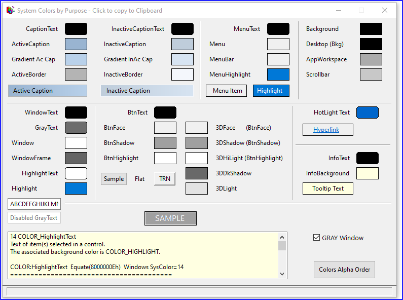
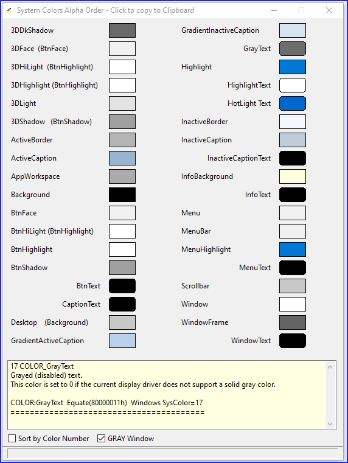
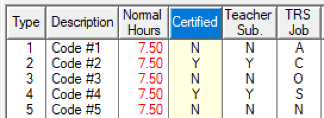
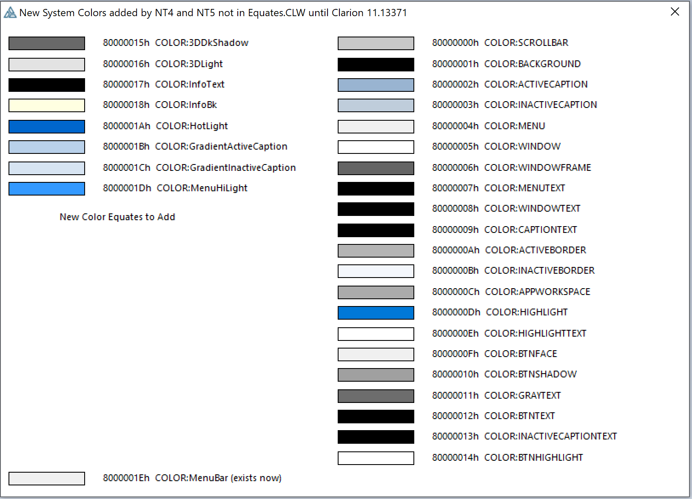

# About System Colors
 -------------------------
A way to view Windows System Colors grouped by Purpose, or Alpha, or Equate Number.

One day I realized that Caption Text (9) went with Active Caption (2) background. Neither the number nor the names grouped the related color together.

On this window click on the flat color buttons to copy the equate to the click board and see the help text below.

What I think are "Text" colors are right aligned and have samples with rounded corners.





### Example
Example of system colors used to highlight a specific list column. The heading is Highlight (like a menu) and the data lines are colored like a tool tip. This was done using PROPLIST:HasSortColumn that was new in C9. Note you do not have to acutaully sort the column nor handle the Event:HeaderPressed, you can just use it to highlight a column.



```
  ?List{PROPLIST:HasSortColumn} = 1
  ?List{PropList:DefHdrBackColor}  = COLOR:BtnFace
  ?List{PropList:DefHdrTextColor}  = COLOR:BtnText
  ?List{PROPLIST:HdrSortBackColor} = COLOR:Highlight     
  ?List{PROPList:HdrSortTextColor} = COLOR:HighlightText 
  ?List{PROPList:SortBackColor}    = COLOR:InfoBackground  !80000018h
  ?List{PROPList:SortTextColor}    = COLOR:InfoText        !80000017h
  ?List{PROPLIST:SortColumn}       = 4  !Highlight column 4
```
### Missing Equates

Also included the missing equates example I submitted to SV. This has the equates you need to use these colors prior to C11.


```
COLOR:3DDkShadow              EQUATE (80000015H)  !Dark shadow for 3D display elements
COLOR:3DLight                 EQUATE (80000016H)  !Light color for 3D display elements 
COLOR:InfoText                EQUATE (80000017H)  !Text color for tooltip controls
COLOR:InfoBackground          EQUATE (80000018H)  !Background color for tooltip controls
COLOR:HotLight                EQUATE (8000001AH)  !Color for a hyperlink or hot-tracked item.
COLOR:GradientActiveCaption   EQUATE (8000001BH)  !Right side color in color gradient of active window title bar. 
COLOR:GradientInactiveCaption EQUATE (8000001CH)  !Right side color in color gradient of inactive window title bar. 
COLOR:MenuHighlight           EQUATE (8000001DH)  !Color to highlight menu items when the menu appears as a flat menu. 
```
