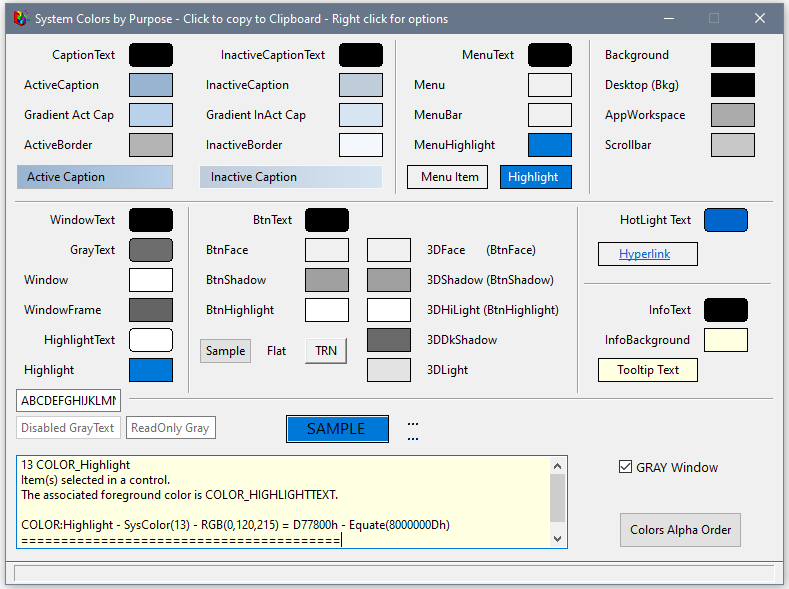
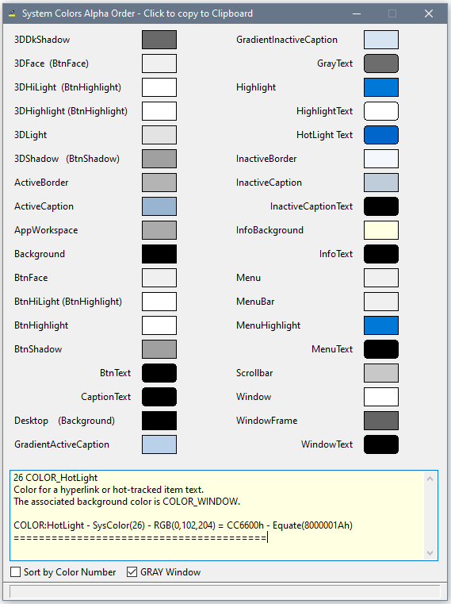

# About System Colors
 -------------------------
A way to view Windows System Colors grouped by Purpose, or Alpha, or Equate Number.

One day I realized that Caption Text (9) went with Active Caption (2) background. Neither the number nor the names grouped the related color together.

On this window click on the flat color buttons to copy the equate to the click board and see the help text below.

What I think are "Text" colors are right aligned and have samples with rounded corners.

